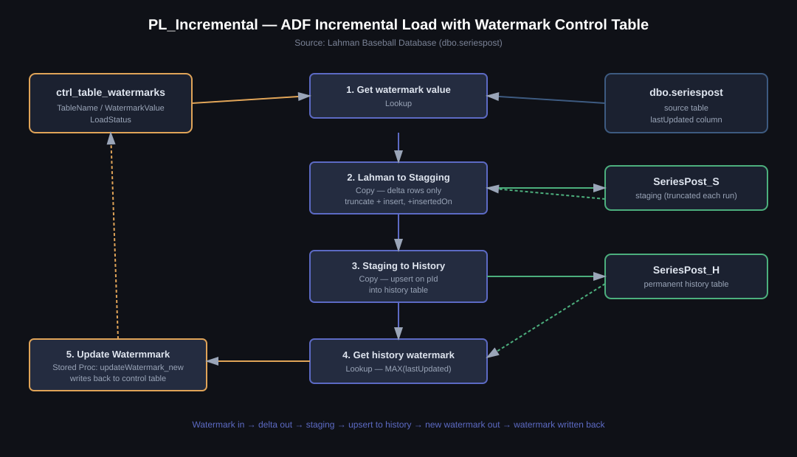

# PL_Incremental — Azure Data Factory Incremental Load Using a Watermark Table

An Azure Data Factory pipeline that incrementally loads Lahman Baseball Database series-results data (`dbo.seriespost`) into a history table, using a **watermark control table** so each run only processes rows that changed since the last successful load.



## Why this pattern

Reloading the full `seriespost` table on every run wastes time and compute as the table grows. This pipeline instead tracks the last-loaded value in `ctrl_table_watermarks` and pulls only rows where `lastUpdated` is newer than that value — a standard incremental-load (delta-load) pattern for ETL into a data warehouse.

## Pipeline flow

`pipeline/PL_Incremental.json` has five activities:

| # | Activity | Type | What it does |
|---|----------|------|---------------|
| 1 | **Get watermark value** | Lookup | Reads the current `WatermarkValue` from `ctrl_table_watermarks` for `TableName = 'seriespost'`. |
| 2 | **Lahman to Stagging** | Copy | Pulls rows from `dbo.seriespost` where `lastUpdated >` the watermark, stamps each with an `insertedOn` timestamp (`@utcNow()`), truncates `SeriesPost_S`, and inserts the delta. |
| 3 | **Staging to History** | Copy | Upserts the staging rows into `SeriesPost_H`, matched on `pId`, so the history table only ever has one row per `pId`. |
| 4 | **Get history watermark** | Lookup | Reads `MAX(lastUpdated)` from `SeriesPost_H` — this becomes the new watermark. |
| 5 | **Update Watermmark** | Stored Procedure | Calls `updateWatermark_new` to write the new watermark value and `LoadStatus = 'Success'` back into `ctrl_table_watermarks`. |

Because the watermark is only advanced in the *last* step, and each Copy activity depends on the previous one succeeding, a failure anywhere in the chain leaves the watermark untouched — the next run safely re-attempts the same window instead of silently skipping or duplicating data.

## Repo structure

```
adf-incremental-load-lahman/
├── README.md
├── docs/
│   └── architecture.svg
├── pipeline/
│   └── PL_Incremental.json         # exported ADF pipeline definition
└── sql/
    ├── 01_create_watermark_control_table.sql
    ├── 02_create_staging_history_tables.sql
    ├── 03_sp_updateWatermark_new.sql
    ├── 04_pipeline_inline_queries_reference.sql
    └── 05_source_table_setup_and_demo_update.sql
```

## Setup / how to reproduce

1. `05_source_table_setup_and_demo_update.sql` (the `ALTER TABLE` portion) adds the `lastUpdated` and `pID` columns the pipeline depends on — the base Lahman `seriespost` table doesn't ship with either. Run this against your source database first.
2. Run the remaining scripts in `sql/` in order (01 → 03) against your Azure SQL Database. `04` is reference only — those queries are already embedded inline in the pipeline's Lookup/Copy activities, not separate objects to deploy.
3. In Azure Data Factory, create linked services and datasets pointing at:
   - `dbo.seriespost` (source)
   - `SeriesPost_S` (staging)
   - `SeriesPost_H` (history)
   - `ctrl_table_watermarks` (control table, referenced by the Lookup activities)
4. Import `pipeline/PL_Incremental.json` and map its dataset references (`DS_Lahman`, `DS_Lah_Stage`, `DS_History`) and linked service (`LS_SQL`) to your own.
5. Run once — the seed watermark of `1900-01-01` means the first run pulls the full table as an initial load.

### Demoing the incremental behavior

Run the `UPDATE` statement in `05_source_table_setup_and_demo_update.sql` (bumps one row's `wins` and `lastUpdated`), then re-run the pipeline. Only that one row should flow through `SeriesPost_S` into `SeriesPost_H`, and `ctrl_table_watermarks.WatermarkValue` should advance to match its new `lastUpdated` — a clean before/after row-count check on `SeriesPost_S` is a good screenshot for this repo.

## Tech stack

- **Azure Data Factory** — orchestration (Lookup, Copy, Stored Procedure activities)
- **Azure SQL Database** — source, staging, history, and watermark control table
- **T-SQL** — control table + `updateWatermark_new` stored procedure

## Notes / possible improvements

- `SeriesPost_H.pId` isn't currently constrained as a primary/unique key — the pipeline's upsert relies on ADF's `upsertSettings.keys`, but adding a real key constraint (see comment in `02_create_staging_history_tables.sql`) would let SQL Server enforce it too and speed up the upsert.
- This pattern catches inserts/updates via `lastUpdated`, not hard deletes on the source — worth calling out if the data can be deleted upstream.
- `ctrl_table_watermarks` is designed to hold one row per tracked table (`SchemaName`, `TableName`, `IsActive`, `SourceSystem`, `Loadtype` columns are already there), so this pipeline could be generalized with a `ForEach` over active rows to load multiple tables from one pipeline.

---
*Built on the [Lahman Baseball Database](https://www.seanlahman.com/baseball-archive/statistics) as a portfolio piece demonstrating an ADF incremental-load design pattern.*
